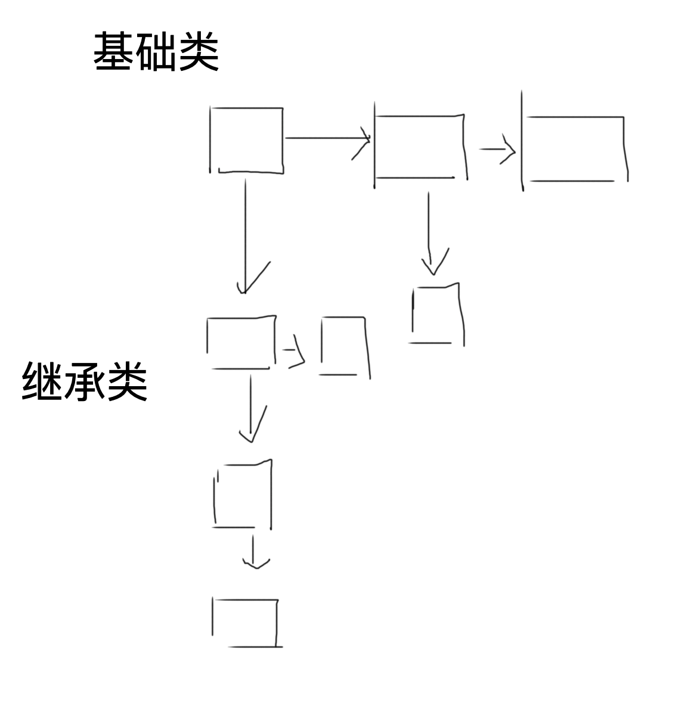

## 分析

Pa4。 ps:分析的[github 师傅的代码](https://github.com/ayadavumass/UndergraduateProjects/tree/master/compilers/ID/cool/src)

### 分析cool 的语法

分析和处理 cool 语句的语法

1. 给每个类定义一个 作用域，利用结构体保存。`ClassTable`
2. 在作用域中，要保证变量没有被重复定义。
3. 保证一个变量或者函数的使用，是在前面的代码中定义过。不能使用没有定义过的变量。
4. 赋值中，保证赋值对象和赋值内容，是同一种type。
5. 在继承树中，继承类中的每个类都是存在的。


### 实现语义的整理

1. 在识别一个变量名时，会先便利本身的继承树里面更具，变量的名字去找是否这个变量名是否已经存在。

2. 对于类的保存，采用的是 类似于 libc里面的smallbins 的结构，这样不但能记录下最基础的类的数量，也能更具这个数据结构去记录下这个类的继承类之间的关系。从而保证类的实现的完整性。

3. 对应不同类型的变量，我们利用不同的， `Class_` 类型的  `tableclass `  来存储 `Object_class` `IO_class` `Int_class` `Bool_class ` `Str_class` 让后将定义了的 class 类型 `add` 到对应的作用域的 `class table` 里面

4. 对于不同类型的 变量，自身就有固定的类函数，所以在初始化类的时候就要将对应的函数和变量添加进去 如：`Str_class` 下的`val` `str_field` `length() : Int` `concat(arg: Str) : Str` `substr(arg: Int, arg2: Int): Str` 然后又根据不同的类型（方法，变量，参数个数）分类添加到对应的类中。如下

   ```c
       // The class Str has a number of slots and operations:
       //       val                                  the length of the string
       //       str_field                            the string itself
       //       length() : Int                       returns length of the string
       //       concat(arg: Str) : Str               performs string concatenation
       //       substr(arg: Int, arg2: Int): Str     substring selection
       //       
       Class_ Str_class =
   	class_(Str, 
   	       Object,
   	       append_Features(
   			       append_Features(
   					       append_Features(
   							       append_Features(
   									       single_Features(attr(val, Int, no_expr())),
   									       single_Features(attr(str_field, prim_slot, no_expr()))),
   							       single_Features(method(length, nil_Formals(), Int, no_expr()))),
   					       single_Features(method(concat, 
   								      single_Formals(formal(arg, Str)),
   								      Str, 
   								      no_expr()))),
   			       single_Features(method(substr, 
   						      append_Formals(single_Formals(formal(arg, Int)), 
   								     single_Formals(formal(arg2, Int))),
   						      Str, 
   						      no_expr()))),
   ```

5. 一个变量的定义，我们要保存它对应的值，和保存它定义的 type ，当进行复制操作等时，要去验证 等号两边的值是否类型相同。

6. 一个类中的函数定义好后，如果有参数，在调用时，要去判断传入的参数的类型，是否对应。

7. 在类的定义时，我们用到的是双向链表，保证类类型的强制转换的正确， `父类->子类。子类-/>父类。` 

8. 且每个类都要定义对应的 error 错误的函数，用于保存，语义分析时的错误。